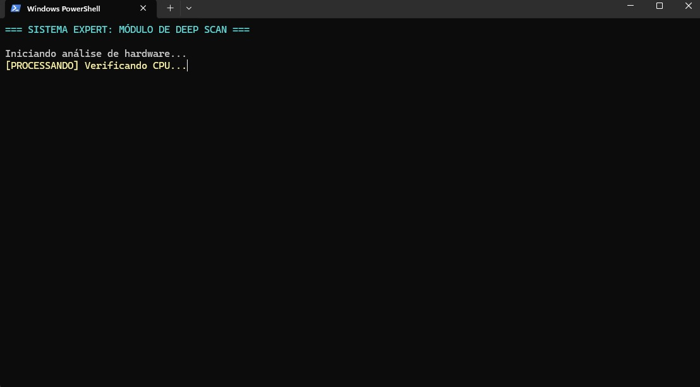

# Scanner Expert - Visibilidade de Status

Este projeto demonstra a aplicação da 1ª Heurística de Nielsen: **Visibilidade do Status do Sistema**.

## 💡 O que foi feito?

Foi desenvolvido um simulador de varredura de sistema que informa ao usuário o progresso em tempo real.

## ⚙️ Como funciona?

- Um loop percorre várias etapas do sistema
- O comando `Thread.Sleep` simula tempo de processamento
- O `\r` permite atualizar a mesma linha no terminal

## 🎯 Benefícios para UX

- Evita que o usuário pense que o sistema travou
- Mantém o usuário informado
- Aumenta a confiança no software

## 📸 Evidência

